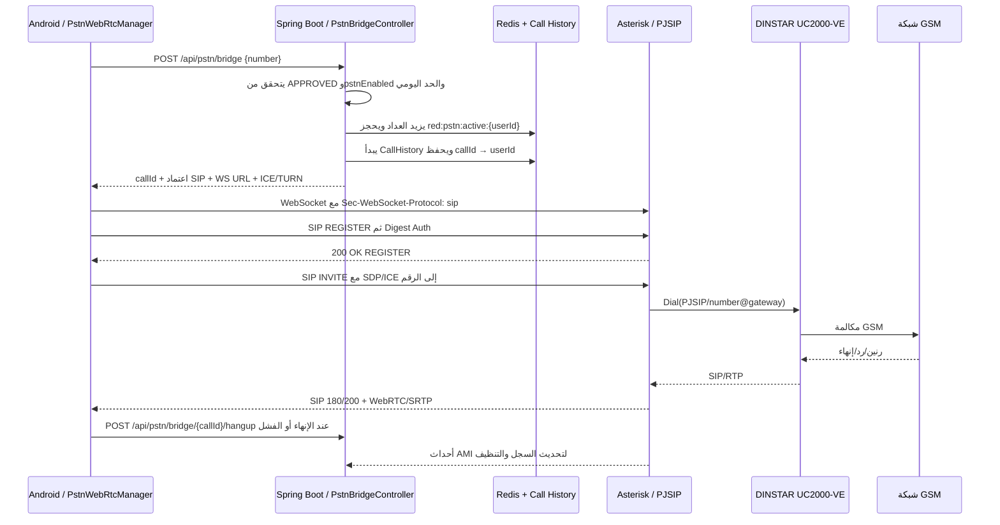
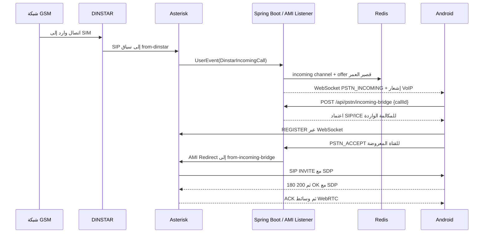

# خريطة مكالمات PSTN والفجوات المرصودة في RED Ultimate

**التاريخ:** 2026-08-21  
**النطاق:** مكالمات PSTN عبر Android وSpring Boot وAsterisk وDINSTAR UC2000-VE فقط. لا يتناول هذا المستند SMS.

## الملخص التنفيذي

يعتمد المشروع على تصميم صحيح من حيث فصل المسؤوليات: يقرر الخادم صلاحية الحساب وحدّه اليومي ويحجز المكالمة، ويتصل Android بـ Asterisk عبر WebRTC/SIP فوق WebSocket، ويعبر Asterisk إلى بوابة DINSTAR باستخدام SIP ثم GSM. لا ينبغي أن يتصل Android بـ DINSTAR مباشرةً؛ لأن ذلك سيتجاوز التفويض والحجز والتتبع وسجل المكالمة.

تمت مراجعة مكونات المسار الرئيسية من المصدر، كما تم التأكد وقت الفحص من أن حاويات `red-backend` و`red-pstn-gateway` و`red-cache` و`red-turn` كانت تعمل، وأن Asterisk يرى contact لبوابة `dinstar-gw-192-168-11-2` في الحالة `Avail`. لم يكن هناك contact ظاهر لعميل `red-webrtc-client`، لذلك لم يُثبت تسجيل Android الحي بعد. تعذر الاستمرار في هذه الخطوة مؤقتاً بسبب انقطاع ADB عن هاتف الاختبار بعد أن كان متصلاً.

> **مهم:** البنود الموسومة بأنها «فجوة مثبتة من الكود» تستلزم إصلاحاً أو اختباراً مركزاً. البنود الموسومة بأنها «فرضية فحص» لا تُعد سبباً نهائياً قبل التقاط سجل SIP/SDP حي.

## المسار الفعلي للمكالمة الصادرة

| الطبقة | مسؤوليتها الحالية | المصدر الأساسي |
|---|---|---|
| Android | طلب bridge، إنشاء `PeerConnection` صوتي، التسجيل SIP، INVITE/BYE، وتجهيز/قبول الوارد | `red-app/.../calls/PstnWebRtcManager.kt` و`WebRtcSipClient.kt` |
| Spring Boot | تفويض المستخدم، الحد اليومي، حجز المكالمة، تسليم اعتماد WSS وICE/TURN، إنهاء الحجز | `backend-server/.../pstn/PstnBridgeController.kt` |
| Redis والسجل | عداد يومي، منع مكالمتين متزامنتين، ربط `callId` بالمالك، سجل بداية/نهاية المكالمة | `PstnBridgeController.kt` و`PstnActiveCallKeys.kt` |
| Asterisk | تسجيل WebRTC، تحويل INVITE إلى DINSTAR، RTP/SRTP، dialplan، وأحداث AMI | `pstn-asterisk/docker-entrypoint.sh` و`extensions.conf` |
| DINSTAR | SIP trunk إلى شبكة GSM، وحالة المنافذ والاتصالات الخلوية | إعداد endpoint المولّد في Asterisk: `dinstar-gw-192-168-11-2` |

## المسار الفعلي للمكالمة الواردة

| حالة الوارد | المسؤول عن المورد | التنظيف المطلوب |
|---|---|---|
| وصول مكالمة DINSTAR | `DinstarEventListener` | مفتاح `red:pstn:incoming:{channel}` وoffer مدته 120 ثانية |
| قبول أول مستخدم مخول | Redis claim وحيد | يمنع قبول جهازين لنفس القناة |
| رفض أحد الأجهزة | لا ينهي المكالمة عن بقية المستلمين | تنتهي بالمهلة أو قبول مستلم آخر |
| Hangup من Asterisk | `DinstarEventListener.handleHangup()` | ينهي السجل ويحرر port والحجز ومفاتيح callId عند وجود رابط موثوق |

## حالة التشغيل المرصودة

| عنصر | نتيجة القراءة فقط | الدلالة |
|---|---|---|
| حاوية Asterisk | `red-pstn-gateway` بحالة healthy | نقطة SIP/AMI متاحة للحكم الحي |
| حاوية الخادم | `red-backend` بحالة healthy | جسر API متاح مبدئياً |
| Redis وTURN | `red-cache` و`red-turn` عاملان | يمكن فصل فشل الحجز عن فشل ICE عند الاختبار |
| DINSTAR contact | `dinstar-gw-192-168-11-2/sip:192.168.11.2:5062` بحالة `Avail` | Asterisk يستطيع الوصول إلى خط SIP المعرّف للبوابة |
| WebRTC contact | لا يوجد contact مسجل لـ `red-webrtc-client` عند الفحص | يجب إثبات REGISTER من Android قبل أي مكالمة مدفوعة |
| هاتف الاختبار | كان مرئياً عبر ADB ثم انقطع أثناء فحص الواجهة | يلزم إعادة الاتصال قبل اختبار التسجيل أو المكالمة |

## الفجوات المرصودة من قراءة الكود

| الأولوية | الملاحظة | التقييم الحالي | الأثر المحتمل | خطوة التحقق/الإصلاح |
|---|---|---|---|---|
| حرجة | `PstnBridgeController` ينشئ `callId` خاصاً بالحجز، بينما `WebRtcSipClient` ينشئ SIP `Call-ID` عشوائياً ولا يمرر `RED_CALL_ID` إلى قناة Asterisk الصادرة | **فجوة مثبتة من الكود** | قد يعجز AMI عن ربط قناة WebRTC/DINSTAR بسجل bridge المحدد، خصوصاً عند تعدد المكالمات أو انقطاع التطبيق | إضافة آلية correlation موثوقة بين bridge callId وقناة Asterisk، ثم اختبار Hangup وتنظيف Redis |
| حرجة | `WebRtcSipClient.sendAck()` يزيد `CSeq` قبل ACK بدلاً من استخدام CSeq الخاص بـ INVITE المقبول | **فجوة بروتوكولية مثبتة من الكود** | بعض خوادم SIP قد ترفض ACK أو تسجل حواراً غير سليم بعد `200 OK` | حفظ CSeq للـ INVITE واستعماله نفسه في ACK، مع اختبار SIP حي |
| عالية | عميل SIP يحسب Digest بصيغة MD5 المبسطة ولا يعالج `qop` أو `nc` أو`cnonce` | **فرضية فحص عالية الأهمية** | قد يفشل REGISTER/INVITE عند challenge يتطلب `qop=auth` | التقاط `WWW-Authenticate` من Asterisk أولاً، ثم تنفيذ RFC المناسب عند الحاجة |
| عالية | الـ SDP يُرسل فور تعيين الوصف المحلي، بينما ICE candidates اللاحقة تُرسل كـ `application/x-ice-info` عبر SIP INFO مخصص | **فرضية فحص عالية الأهمية** | قد تنجح الإشارة لكن تفشل الوسائط خارج LAN أو عند عدم وجود مرشح host مناسب | فحص SDP وICE حي؛ اعتماد offer كامل المرشحين أو trickle ICE بالطريقة المتوافقة مع Asterisk عند اللزوم |
| عالية | مسار WSS المحلي الحالي في ملخص البيئة هو `ws://192.168.11.131:8089/ws`، مع transport Asterisk من نوع `ws` لا `wss` | **فجوة أمان/نشر مؤكدة للتشغيل خارج LAN** | الاعتماد وكشف الإشارات غير مناسبين خارج شبكة موثوقة | إبقاء WS للاختبار المحلي فقط؛ اعتماد TLS عند الحافة أو transport WSS صحيح قبل النشر الخارجي |
| متوسطة | endpoint واحد مشترك باسم `red-webrtc-client` وله حتى خمسة contacts | **قيد تصميمي مثبت** | لا يوفر هوية SIP منفصلة لكل حساب، ويصعّب استهداف مستخدم محدد في المكالمة الواردة | مناسب لاختبار الحساب الوحيد؛ يقيّم لاحقاً اعتماد حساب/Contact منفصل لكل مستخدم قبل التوسع |
| متوسطة | `PstnCallService.dial()` هو مسار AMI أقدم مستقل، بينما Android يستخدم `/api/pstn/bridge` ثم SIP مباشرة | **ازدواج مسار مثبت** | اختلاف الحجز والسجل والـ callId بين المسارين قد ينتج إصلاحاً في مسار دون الآخر | توثيق المتحكم الذي يستدعي كل مسار، وتحديد مسار PSTN المعتمد للتطبيق قبل مزيد من التوسع |
| متوسطة | تعديل mute/speaker يغيّر track أو الحالة لكن التعليق يذكر أن AudioManager يعالج speaker في موضع آخر | **نقطة تكامل قيد التحقق** | قد يعمل اتصال الشبكة ويظل الصوت غير موجّه كما يتوقع المستخدم | فحص مسار `AudioManager` و`ConnectionService` في اختبار صوت حي بعد نجاح التسجيل |

## حدود الإصلاح

لا تُغيَّر إعدادات DINSTAR ولا تستبدل البوابة أو Asterisk أو مكتبة العميل لمجرد وجود بديل أحدث. يبدأ الإصلاح من إثبات التسجيل الحي وسجل SIP، ثم تُعالج فجوات البروتوكول والربط التي تظهر بالدليل. لا يُستخدم رقم الاختبار الذي قدّمه المستخدم إلا لمكالمة واحدة مراقبة بعد نجاح بوابة REGISTER غير المدفوعة. جميع أرقام الهواتف ومعرّفات المصادقة يجب إخفاؤها من التقارير والسجلات المشتركة.

## الخطوة التالية

إعادة اتصال جهاز Android عبر ADB، ثم تفعيل تسجيل PJSIP مؤقتاً والتقاط: WebSocket handshake، REGISTER الأول، تحدي Digest، REGISTER الموثق، وحالة `pjsip show contacts`. لا يتم إرسال INVITE إلى رقم خارجي في هذه الخطوة.

## تحديث الفحص الحي — 2026-08-21

تم تسجيل الدخول إلى واجهة إدارة UC2000-VE بعد تأكيد المستخدم. في اختبار المكالمة الحي، نجح Asterisk في تمرير INVITE من `red-webrtc-client` إلى endpoint `dinstar-gateway` ثم إلى `192.168.11.2:5062`. يثبت سجل PJSIP أن **UC2000-VE نفسها** أعادت `SIP/2.0 503 Service Unavailable` للـINVITE الصادر؛ لذلك لم يعد مسار WebSocket أو تسجيل SIP من Android هو العائق الأول. أُنهِيت قناة DINSTAR فوراً بعد المراقبة، ثم تأكد عدم بقاء قنوات Asterisk نشطة أو مفاتيح Redis انتقالية (`active` أو `calluser`).

الخطوة التالية هي فحص حالة منافذ GSM وقواعد IP-to-Tel/VoIP-to-GSM في UC2000-VE قراءةً فقط، مع عدم حفظ أي تغيير قبل عرض التشخيص وطلب موافقة صريحة.

### مسارات UC2000-VE المتاحة بعد الدخول

أكدت قائمة إدارة UC2000-VE وجود صفحات منفصلة لـ **SIP Trunk Configuration** و**SIP Trunk Group Configuration** و**Port Configuration** و**Port Group Configuration** و**IP->Tel Routing** و**Tel->IP Routing**. وبما أن INVITE الصادر وصل إلى UC2000-VE ثم أعاد 503، فالأولوية هي قراءة IP->Tel Routing وحالة المنافذ/المجموعات بدلاً من تعديل WebRTC أو Asterisk عشوائياً.

## نتيجة شبكة مضيف Asterisk — دليل إضافي

أظهر المضيف المحلي واجهتين فعالتين ضمن نفس المجال العددي `192.168.11.0/24`: واجهة Ethernet المسماة `kk` بالعنوان `192.168.11.105` وmetric `25`، وWi‑Fi بالعنوان `192.168.11.131` وmetric `50`. وصل UC2000-VE من Ethernet فقط: نجح ping ملزم المصدر من `.105` وفشل من `.131`. كما ظهر في رد UC2000 للـINVITE أن البوابة رأت مصدر Asterisk بعد NAT بوصفه `received=192.168.11.105`.

نجح SIP OPTIONS/qualify غير المدفوع إلى endpoint `dinstar-gateway` وبقي contact في الحالة `Avail` بزمن يقارب 6 ms، وهو ما يثبت قابلية الوصول SIP فقط. لكنه لا يثبت توفر SIM أو قبول قاعدة IP→Tel. وبما أن `503` جاء من UC2000 نفسها رداً على INVITE، ففحص قاعدة IP→Tel يجب أن يطابق المصدر الفعلي `.105` — لا عنوان Wi‑Fi `.131` — إضافة إلى dialed-number rule ومجموعة منافذ GSM المتاحة.

> ملاحظة تشغيلية: لم يُنشأ مسار شبكة مؤقت بسبب رفض Windows العملية بصلاحيات الجلسة؛ تحقق بعدها أن لا route مضيف جديد إلى UC2000 موجود، فلم يتغير توجيه الشبكة.
